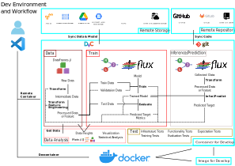

# acea-smart-water-analytics

[](https://github.com/invenia/BlueStyle)
[](https://open.vscode.dev/yezhengkai/acea-smart-water-analytics)

Practice the Julialang ML workflow using data from [Acea Smart Water Analytics](https://www.kaggle.com/c/acea-water-prediction/overview) competition.



# How to Use
This instruction is for **Ubuntu** and **Windows 10/11** user.

Please note that we use docker to run containers, and **containers running on Windows 10 cannot access native GPU resources (more specifically NVIDIA CUDA)** under normal circumstances.

## Prerequisite
**You need to install or setup the following tools**

1. Git
1. Docker and Docker Compose
1. VS Code

If you are a **Windows** user, please install additional tools **first**.
1. Windows Terminal
1. Windows Subsystem for Linux (WSL)

See the following subsections **in order** to install or set up the necessary tools.

### Windows Terminal (Windows User)
Download Windows Terminal from [here](https://www.microsoft.com/zh-tw/p/windows-terminal/9n0dx20hk701?activetab=pivot:overviewtab) to get a better terminal experience.

### WSL (Windows User)
> You must be running Windows 10 version 2004 and higher (Build 19041 and higher) or Windows 11.
> If you're running an older build, or just prefer not to use the install command and would like step-by-step directions, see [WSL manual installation steps for older versions](https://docs.microsoft.com/en-us/windows/wsl/install-manual).

1. Open the **Windows Terminal**. Then, install **WSL2** and the Ubuntu-20.04 distribution as default with the following command.
    ```powershell
    wsl --install -d Ubuntu-20.04
    wsl --set-default Ubuntu-20.04
    ```
1. Check if your Ubuntu-20.04 distribution uses **WSL 2**.
    ```powershell
    wsl -l -v
    ```
    If your Ubuntu-20.04 distribution uses WSL 1, please use the following command to set your Ubuntu-20.04 distribution to use WSL 2.
    ```powershell
    wsl --set-version Ubuntu-20.04 2
    ```

### Git
We will use Git installed in the container for version control. VS Code will detect the git configuration file in the host and bring the basic configuration to the container (thanks to VS Code 🙌), so please follow the instructions below to set it up
#### Windows
1. Open the **Windows Terminal** and start the Ubuntu-20.04 shell.
    ```powershell
    wsl
    ```
1. Set global configuration file (~/.gitconfig).
    > ℹ️ You should change the YOUR_USERNAME and YOUR_EMAIL to your own.
    ```bash
    git config --global user.name "YOUR_USERNAME"
    git config --global user.email "YOUR_EMAIL"
    ```

#### Ubuntu
I think you can set up basic ~/.gitconfig file smoothly. 😃

### Docker and Docker Compose
> ℹ️ You should know the terminology of container technology.
> - **Docker**: A program that implements container technology.
> - **Container**: Similar to virtual environments. Your application will run inside the container.
> - **Image**: Think of it as a snapshot of the container. Can quickly generate containers from images.

#### Windows
1. Download **Docker desktop for Windows** from [official website](https://hub.docker.com/editions/community/docker-ce-desktop-windows) and install it.
1. Start Docker Desktop, and select **Settings (gear icon in the upper right corner) > General** to check whether the **Use WSL 2 based engine** check box is selected. If it is not checked, please select it.

#### Ubuntu
If you want to use NVIDIA GPU in container you also need to install [NVIDIA Container Toolkit](https://github.com/NVIDIA/nvidia-docker).
I think you can install docker, docker compose and NVIDIA Container Toolkit smoothly by yourself. 😃

### VS Code
1. Download VS Code from the [official website](https://code.visualstudio.com/) and install it.
1. Install **Remote Development** from [here](https://marketplace.visualstudio.com/items?itemName=ms-vscode-remote.vscode-remote-extensionpack).


## Setup Development Environment

> ⚠️
> - This is an instruction to establish a development environment, not a deployment environment.
> - Make sure docker is running in the background.

### Windows
1. Start **VS Code**.
1. Press `F1` or `ctrl+shift+p` to open Command Palette (interactive prompt will appear in the top center)
1. Type **Remote-WSL: New WSL Window** to search for command (search function is not case sensitive).
1. Use the keyboard up and down keys to select the **Remote-WSL: New WSL Window** command and press "Enter" (the selected command will be highlighted) or use the mouse to click the **Remote-WSL: New WSL Window** command.
1. Switch to the new window connected to WSL. Check for the **WSL: Ubuntu-20.04** prompt on the left side of the status bar (at the bottom of the window).
1. Click **Source Control** tab in the left side bar.
1. Click the **Clone Repository** to clone this repo.
1. Paste the **https://github.com/yezhengkai/acea-smart-water-analytics.git** into the interactive prompt at the top center of the window and press "Enter".
1. In the interactive prompt at the top center of the window, select the **preferred path to store the cloned repository** and press "Enter".
1. After the clone is successful, a notification will appear in the lower right corner to remind you to open the cloned repository. Please click **"Open"**.
1. After successfully opening the project in WSL, a notification will be displayed in the lower right corner to remind you that you can use the container. Click **"Reopen in Container"** to building the image and run the container.
1. When image and container are successfully built, press **``ctrl+shift+` ``** in VS Code to open integrated terminal . Install development dependencies and setup pre-commit hooks with the following command.
    ```bash
    inv env.init-dev
    ```
1. Your development environment has been well established. You can leave VS Code or go to next section.


### Ubuntu
1. Start **VS Code**.
1. Click **Source Control** tab in the left side bar.
1. Click the **Clone Repository** to clone this repo.
1. Paste the **https://github.com/yezhengkai/acea-smart-water-analytics.git** into the interactive prompt at the top center of the window and press "Enter".
1. In the interactive prompt at the top center of the window, select the **preferred path to store the cloned repository** and press "Enter".
1. After the clone is successful, a notification will appear in the lower right corner to remind you to open the cloned repository. Please click **"Open"**.
1. After successfully opening the project, a notification will be displayed in the lower right corner to remind you that you can use the container. Click **"Reopen in Container"** to building the image and run the container.
1. When image and container are successfully built, press **``ctrl+shift+` ``** in VS Code to open integrated terminal .Install development dependencies and setup pre-commit hooks with the following command.
    ```bash
    inv env.init-dev
    ```
1. Your development environment has been well established. You can leave VS Code or go to next section.

## Usage

> ⚠️
> - Make sure docker is running in the background.
> - Ensure that the development environment is set up correctly.
> - If your container is gone, open the folder in VS Code(note for Windows user: VS Code should open in WSL) and press `F1` or `ctrl+shift+p` to use **Remote-Containers: Reopen in Container** command.
> - If devcontainer has changed, open the folder in VS Code(note for Windows user: VS Code should open in WSL) and press `F1` or `ctrl+shift+p` to use **Remote-Containers: Rebuild and Reopen in Container**.

Follow the instruction below to run container.
1. Start **VS Code**.
1. Click **Remote Explorer** tab in the left side bar.
1. Select **Containers** in the drop-down menu to display the available Dev Containers.
1. Click the **Open Folder in Container icon** on the right side of the acea-smart-water-analytics label.
1. The VS Code will reopen the window that connect the container (check if there is a prompt for **Dev Container: acea-smart-water-analytics** in the lower left corner of the window).


### Predefined Tasks
> ⚠️ The predefined tasks defined in the `tasks` directory use relative paths, so make sure that the current working directory is **acea-smart-water-analytics**

When VS Code is connected to the container, you can use the integrated terminal (press **``ctrl+shift+` ``** to open terminal) to run following tasks.

- Install development dependencies and setup pre-commit hooks.
    ```bash
    inv env.init-dev
    ```
- Download all dependencies of the current julia project and precompile all dependencies.
    ```bash
    inv env.julia-instantiate
    ```
- Run `jupyter lab` at notebooks directory.
    ```bash
    inv nb.lab
    ```
- Run `Pluto.jl` at notebooks directory.
    ```bash
    inv nb.pluto
    ```
- Format your code through `JuliaFormatter.jl`.
    ```bash
    inv style.reformat
    ```
- Run test coverage check.
    ```bash
    inv test.cov
    ```
- Run test cases.
    ```bash
    inv test
    ```

# References
- [Install WSL](https://docs.microsoft.com/en-us/windows/wsl/install)
- [Install Docker Desktop on Windows](https://docs.docker.com/desktop/windows/install/)
- [Using Docker as a Dev Environment with VS Code: Part 2](https://spin.atomicobject.com/2021/06/16/docker-development-container/)
- [DrWatson.jl Docs](https://juliadynamics.github.io/DrWatson.jl/stable/)
- [GitHub: terasakisatoshi/jldev_poetry](https://github.com/terasakisatoshi/jldev_poetry)
- [GitHub: cjolowicz/hypermodern-python](https://github.com/cjolowicz/hypermodern-python)
- [GitHub: Lee-W/cookiecutter-python-template](https://github.com/Lee-W/cookiecutter-python-template/tree/0.7.1)
- [GitHub: dgoings/docker-dev-example](https://github.com/dgoings/docker-dev-example)
